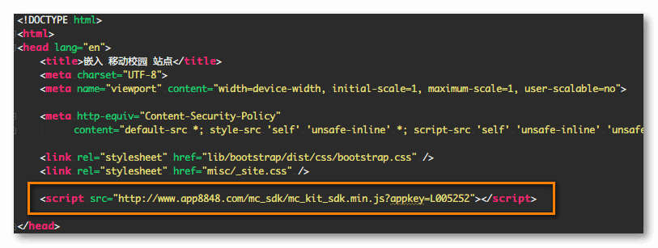
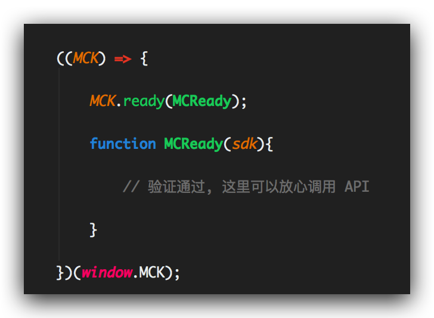

# 移动校园 SDK 使用说明

该文档正在不断完善, 请以最新版本为参考.


### Scheme

* 安装
* [使用](#setup2)
	* [命名空间](#setup2_1)
	* [验证回调](#setup2_2)
	* [调用API](#setup2_3)
* [API列表](#apiList)
* [示例](#example)


### 1. 安装

请在 `<head>` 标签中添加 sdk `<script>`



sdk地址: [http://www.app8848.com/mc_sdk/mc_kit_sdk.min.js?appkey=LIMC0001](http://www.app8848.com/mc_sdk/mc_kit_sdk.min.js?appkey=LIMC0001 "MC-SDK")


### 2. 使用

!

#### 2.1 命名空间

移动校园sdk, 仅在全局扩展 `MCK` 的命名空间.


#### 2.2 验证回调

当集成H5界面开始加载, sdk 便自动验证当前H5是否为可信任.
若信任验证成功, 则可以正常使用 API.

由于验证是异步, 因此sdk提供验证成功回调:



Tips:

* `MCK.ready` 方法可调用多次.
* 若已验证成功, 调用 `MCK.ready`, 会立即执行传入的回调函数.


#### 2.3 调用API

#### 2.3.1 SDK 相关 API:

| 方法 | 描述   |
| ------------- | ------------- |
| MCK.ready(fn) | 验证成功之后回调 |
| MCK.conflict() | 若MCK命名冲突, 则可以使用该方法恢复. |
| MCK.auth() | sdk 会在合适的情景自动调用. 一般情况下, 开发者无需手动调用. |

<br>

#### 2.3.2 H5 相关 API

__返回可调用的所有方法的数组:__

	MCK.h5.getApi();

| 参数 | 类型 | 描述   |
| ------------- | ------------- | ------------- |
| 无 | - | - |

Callback Data: `Array`

	[
		"GETUSERINFO",
		"TAKEPHOTO",
		"PICKPHOTO",
		"TAKEORPICKPHOTO",
		"PICKPICTURES",
		"LOGOUT",
		"EXITAPP",
		"SHARE",
		 //..
	]

<br>

__调用API:__

	MCK.h5.call(apiName, data, callback);

| 参数 | 类型 | 描述   |
| ------------- | ------------- | ------------- |
| apiName | string | API名称, 调用移动校园提供的 API, 看 [API LIST](#apiList) |
| data | * | 接口参数 |
| callback | function | 回调函数 |

<br>

### 3. API LIST

__3.1 获取用户基本信息__

	MCK.h5.call("getUserInfo");

Parameters:

| 参数 | 类型 | 描述   |
| ------------- | ------------- | ------------- |
| 无 | - | - |

Callback Data: `Object`

	{
	  userName: "用户名",
	  userId: "学号",
	  realName: "真实姓名",
	  sex: "性别" ,
	  role: "角色",
	  profile: "头像地址"
	}

性别(sex):

* 1 为男
* 2 为女
* 3 为未知

角色(role):

* 1: "学生"
* 2: "教职工"
* 3: "研究生"
* 4: "软件供应商"
* 9: "游客"


<br>

__3.2 调用相机或通过相册选择照片__

	MCK.h5.call("takeOrPickPhoto", config, callback);

Parameters:

| 参数 | 类型 | 描述   |
| ------------- | ------------- | ------------- |
| config.allowEdit | Boolean | 是否允许编辑 |
| config.targetWidth | Number | 图片宽度 |
| config.targetHeight | Number | 图片高度 |
| config.quality | Number | 图片压缩比例(0-100) |

Callback Data:

	图片base64编码

<br>

__3.3 调用三方分享__

	MCK.h5.call("share", config, callback);

Parameters:

| 参数 | 类型 | 描述   |
| ------------- | ------------- | ------------- |
| config.title | String | 分享的标题  |
| config.content | String | 分享的内容 |
| config.imgSrc | String | 分享的图片 |
| config.url | String | 分享后可访问链接 |

Callback Data:

	{
		// statusCode 可选值为: 1 || 0
		// 1为分享成功, 0 为分享失败
		status: statusCode
    }

<br>

__3.4 注销登录__

	MCK.h5.call("logout");

Parameters:

| 参数 | 类型 | 描述   |
| ------------- | ------------- | ------------- |
| 无 | - | - |

Callback Data:

	无

<br>

__3.5 退出应用__

	MCK.h5.call("exitApp");

Parameters:

| 参数 | 类型 | 描述   |
| ------------- | ------------- | ------------- |
| 无 | - | - |

Callback Data:

	无

<br>

### 4. Example

```javascript
(function(MCK){

	MCK.ready(MCReady);

	function MCReady(sdk){

		// 这里 sdk 即是 MCK
		// MCK === sdk

		sdk.h5.call("getUserInfo", function(userData){
			// userData 为APP中传入的 用户数据
			console.log(JSON.stringify(userData));
		});
	}

})(window.MCK);
```
